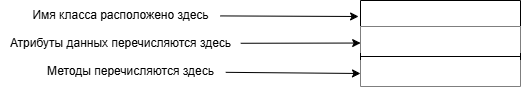
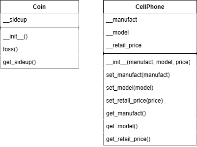

# 10.4.0 - Унифицированный язык моделирования.
Во время разработки класса часто полезно нарисовать диаграмму **UML(Unifited Modeling Language - Унифицированный язык моделирования)**. Это стандартный набор диаграмм для графического изображения объектно-ориентированных систем.
Диаграмма представляет собой прямоугольник, разделенный на три секции. Описание секций представленно ниже:

Согласно макету, вот так будут выглядеть UML-диаграммы для предыдущих классов Coin и CellPhone:

> Обратите внимание, что параметр **self** не указан ни в одном из методов, т.к предполагается, что **параметр self является обязательным**.