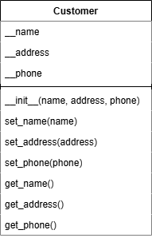
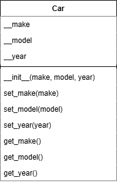
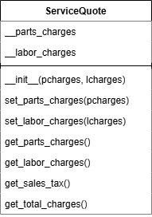

# 10.4.1 - Идентификация классов в задаче.
Во время разработки объектно-ориентированной программы одной из первых задач является идентификация классов, которые потребуется создать. Для этого идентифицируются различные типы реальных объектов задачи и затем создать классы для этих типов объектов в приложении.

Один из простых методов идентификации связан со следующими шагами:
1. **Получить письменное описание предметной области задачи.**
2. **Идентифицировать в описании все именные группы (включая существитетельные, местоимения и именные словосочетания). Каждая из них является потенциальным классом.**
3. **Уточнить полученный список, чтобы он включал только те классы, которые относятся к задаче.**

> Взглянем на этот подход поближе.

## Составление описания предметной области задачи.
**Предметной области задачи** - набор объектов реального мира, участников и крупных событий, связанных с задачей.

Описание предметной области задачи должно включать любой из приведенных ниже пунктов:
- Физические объекты, такие как автомобили, механизмы или изделия;
- Любую роль, выполняемую человеком, такую как менеджер, сотрудник, клиент, учитель и т.д;
- Результаты делового процесса, такие как заказ клиента, расценки услуг и т.п;
- Элементы, связанные с ведением учета, такие как история обслуживания клиента и зарплатные ведомости.

## Идентификация всех именных групп.
На этом этапе происходит выделение из описания предметной области именных групп, если описание содержит местоимения, то включать их тоже. В ходе выделения именных групп они могут повторяться, в конечно итоге стоит выделить их всех без повторения подведя их к списку вида:
- Группа 1;
- Группа 2;
- Группа 3;
- ...

## Уточнение списка именных групп.
Следущий шаг состоит в совершенствовании списка, чтобы оставить только те классы, которые необходимы для решения задачи. Обратимся к общим причинам, почему именная группа может быть устраненна из списка потенциальных классов:
1. Некоторые именные группы по существу означают одно и тоже.
    - Например **легковые автомобили**, **легковой автомобиль** и **зарубежные легковые авто** относятся к классу **легковой автомобиль**.
2. Некоторые именные группы могут представлять элементы, которые не требуются для решения задачи.
    - Например, необходимо чтобы приложение распечатывало расценки на услуги, однако у нас в именной группе есть **"цех"** и **"менеджер"**, они для выполнения данной функции не нужны, поэтому в конкретном примере их можно удалить.
3. Некоторые именные группы представляют собой не классы, а объекты.
    - Например, в списке есть марки авто, однако они не станут классами, т.к являются объектами класса авто.
4. Некоторые именные группы представляют собой простые значения, которые могут быть присвоены переменной, и не требуют класса.
    - Для того, чтобы определить, представляет ли именная группа элемент, который имеет атрибуты данных и методы, необходимо задать о ней следующие вопросы:
        - Будет ли использоваться группа значений для представления состояния этого элемента?
        - Существуют ли какие-либо очевидные действия, которые этот элемент должен выполнять?

Если ответы на оба этих вопроса отрицательные, то именная группа представляет значение, которое может быть сохранено в простой переменной.

В конечном итоге из списка остались только **легковые автомобили**, **клиент**, **расценка на услуги**. Это значит про приложению нужны классы для их представления, это будут:
- **Car**;
- **Customer**;
- **ServiceQuote**.

## Идентификация обязанностей класса.
Следующим шагом является определение обязанностей каждого класса.

**Обязанности класса** - это:
- то, что класс обязан знать;
- действия, которые класс обязан выполнять.

Для определения обязанностей стоит задать следующий вопрос: **"Что именно класс должен знать и что именно класс должен делать в контексте поставленной задачи?"**.

>Рассмотрим работу этого вопроса проектируя классы:

### Класс Customer
Что класс Customer должен знать в контексте предметной области?
- Имя клиента;
- Адрес клиента;
- Телефонный номер клиента.

Что именно класс Customer должен делать в контексте нашей предметной области?
- Инициализировать объект класса Customer;
- Задать и вернуть имя клиента;
- Задать и вернуть адрес клиента;
- Задать и вернуть телефонный номер клиента.

Для отображения этого построим UML- диаграмму:



> Код класса [customer.py](customer.py):
```python
# Класс Customer
class Customer:
    # Инициализировать объекта класса
    def __init__(self, name, address, phone):
        self.__name = name
        self.__address = address
        self.__phone = phone

    # Задать имя
    def set_name(self, name):
        self.__name = name

    # Задать адресс
    def set_address(self, address):
        self.__address = address

    # Задать номер телефона
    def set_phone(self, phone):
        self.__phone = phone

    # Вернуть имя
    def get_name(self):
        return self.__name

    # Вернуть адресс
    def get_address(self):
        return self.__address

    # Вернуть номер телефона
    def get_phone(self):
        return self.__phone
```

### Класс Car
Что класс Car должен знать в контексте предметной области?
- Изготовитель легкового автомобиля;
- Модели легкового автомобиля;
- Год изготовления легкового автомобиля.

Что именно класс Car должен делать в контексте нашей предметной области?
- Инициализировать объект класса Car;
- Задать и получить изготовителя легкового автомобиля;
- Задать и получить модель легкового автомобиля;
- Задать и получить год изготовления легкового автомобиля.

Для отображения этого построим UML- диаграмму:



> Код класса [car.py](car.py):
```python
# Класс Car
class Car:
    # Инициализировать объекта класса
    def __init__(self, make, model, year):
        self.__make = make
        self.__model = model
        self.__year = year

    # Задать изготовителя
    def set_make(self, make):
        self.__make = make

    # Задать адресс
    def set_model(self, model):
        self.__model = model

    # Задать номер телефона
    def set_year(self, year):
        self.__year = year

    # Вернуть изготовителя
    def get_make(self):
        return self.__make

    # Вернуть модель
    def get_model(self):
        return self.__model

    # Вернуть год изготовления
    def get_year(self):
        return self.__year
```

### Класс ServiceQuote
Что класс ServiceQuote должен знать в контексте предметной области?
- Оценочная стоимость запчастей;
- Оценочная стоимость трудозатрат;
- Налог с продаж;
- Общая оценочная стоимость расходов.

Что именно класс ServiceQuote должен делать в контексте нашей предметной области?
- Инициализировать объект класса ServiceQuote;
- Задать и получить стоимость запчастей;
- Задать и получить стоимость трудозатрат;
- Получить оценочная стоимость расходов;
- Получить налог с продаж.

Для отображения этого построим UML- диаграмму:



> Код класса [servicequote.py](servicequote.py):
```python
# Константа для вставки налога с продаж
TAX_RATE = 0.05

# Класс ServiceQuote
class ServiceQuote:
    # Инициализировать объекта класса
    def __init__(self, pcharges, lcharges):
        self.__parts_charges = pcharges
        self.__labor_charges = lcharges

    # Задать оценочную стоимость запчастей
    def set_parts_charges(self, pcharges):
        self.__parts_charges = pcharges

    # Задать оценочную стоимость трудозатрат
    def set_labor_charges(self, lcharges):
        self.__labor_charges = lcharges

    # Задать оценочную стоимость запчастей
    def get_parts_charges(self):
        return self.__parts_charges

    # Получить оценочную стоимость трудозатрат
    def get_labor_charges(self):
        return self.__labor_charges

    # Получить налог с продаж
    def get_sales_tax(self):
        return self.__parts_charges * TAX_RATE

    # Получить оценочная стоимость расходов
    def get_total_charges(self):
        return self.__parts_charges + self.__labor_charges + (self.__parts_charges * TAX_RATE)
```